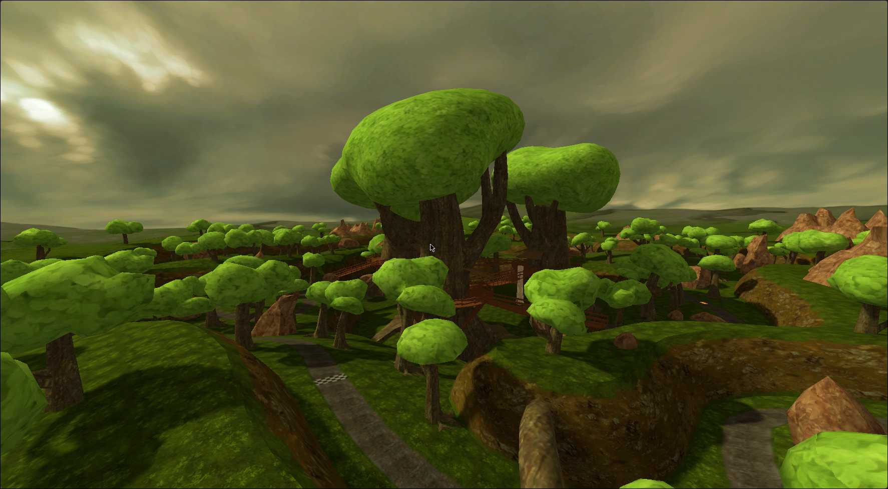
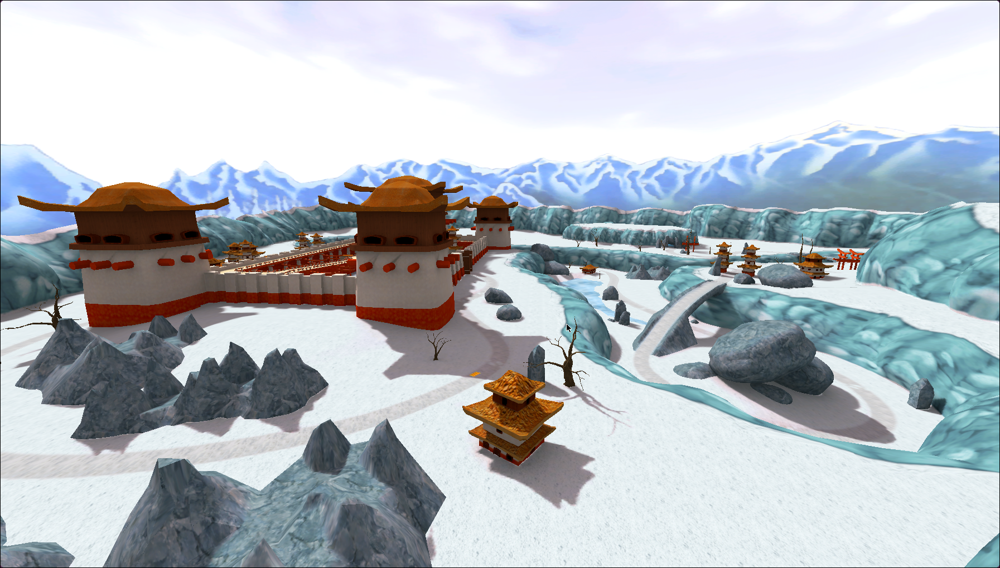

# MHLIB

A project to make the old classic Moorhuhn Games playable
on modern systems via an engine reimplementation, written
in Rust and Godot.

This means that there is no need to ship any copyrighed material, since
the game will load the original assets from your own installation of the
original game (but obviously means you need to own it).

Most of the Moorhuhn Games are structured quite similarly,
which makes supporting them relatively easy.

## Progress

### Moorhuhn Kart 3

3D files are preprocessed on first launch into a `.pck`. Map loading is ~90% complete, I've decided against
loading `lws` scenes for now, since all the static models are aligned to the origin, and loading them semi-manually opens up the door for easier remastering.

### Schatzjäger 1-3

All non-interactive map elements load, all assets can be pre-processed, UI can be converted, collision
works, movement *should* work relatively 1:1 compared to the original.

## Supported Games

Support of games primarily depends on who developed them - Games with structurally similar data are easier to support than games who use a different engine.

* `.wtn` "Witan Entertainment Engine"
	* [ ] Moorhuhn
	* [ ] Moorhuhn 2
* `.dat` Power Render 3D Engine
	* [ ] Moorhuhn Kart
	* [ ] Moorhuhn Kart Extra
* `data/datafile.dat` "Sproing Interactive Engine"
	* [ ] Moorhuhn Winter
	* [ ] Moorhuhn 3
	* [ ] Moorhuhn X
	* [ ] Moorhuhn Kart 2 (Renderware)
	* [ ] Moorhuhn Remake
	* [ ] Moorhuhn Invasion
	* [x] Moorhuhn Schatzjäger 1
	* [ ] Moorhuhn Piraten
	* [x] Moorhuhn Schatzjäger 2
	* [x] Moorhuhn Schatzjäger 3
	* [ ] Moorhuhn Invasion
* `.sar` Starforce 3D Engine (Visual Imagination Software "VIS" GbR): LightWave 3D + Open Dynamics Engine + CEGUI
	* [x] Moorhuhn Kart 3
	* [ ] Moorhuhn Director's Cut
	* [ ] Moorhuhn Kart Thunder
* `*.dat` "Phenomedia 2D Engine"
	* [ ] Schatz des Pharao
	* [ ] Fluch des Goldes
	* [ ] Moorhuhn Wanted
* `*.dat` "SnapDragon Games Engine"
	* [ ] Moorhuhn Atlantis
* Other games with unknown engine
	* [ ] Moorhuhn im Anflug
	* [ ] Moorhuhn Mah-Jongg
	* [ ] Moorhuhn Soccer
	* [ ] Moorhuhn - Juwel der Finsternis
	* [ ] Moorhuhn DS
	* [ ] Moorhuhn Star Karts
	* [ ] Moorhuhn Jahrmarkt-Party
	* [ ] Moorhuhn Tiger & Chicken
	* [ ] Moorhuhn Xtreme
