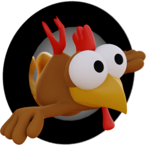

# MHLIB

A project to make the old classic Moorhuhn Games playable
on modern systems via an engine reimplementation, written
in Rust and Godot.

Most of the Moorhuhn Games are structured quite similarly,
which makes supporting them relatively easy.

## Supported Games

Support of games primarily depends on who developed them - Games with structurally similar data are easier to support than games who use a different engine.

* `.wtn` "Witan Entertainment Engine"
	* [ ] Moorhuhn
	* [ ] Moorhuhn 2
* `.dat` Torque3D Engine
	* [ ] Moorhuhn Kart
	* [ ] Moorhuhn Kart Extra
* `data/datafile.dat` "Sproing Interactive Engine"
	* [ ] Moorhuhn Winter
	* [ ] Moorhuhn 3
	* [ ] Moorhuhn X
	* [ ] Moorhuhn Kart 2
	* [ ] Moorhuhn Remake
	* [ ] Moorhuhn Invasion
	* [x] Moorhuhn Schatzjäger 1
	* [ ] Moorhuhn Piraten
	* [x] Moorhuhn Schatzjäger 2
	* [x] Moorhuhn Schatzjäger 3
	* [ ] Moorhuhn Invasion
* `.sar` Starforce 3D Engine (Visual Imagination Software "VIS" GbR)
	* [ ] Moorhuhn Kart 3
	* [ ] Moorhuhn Director's Cut
	* [ ] Moorhuhn Kart Thunder
* `*.dat` "Phenomedia 2D Engine"
	* [ ] Schatz des Pharao
	* [ ] Fluch des Goldes
	* [ ] Moorhuhn Wanted
* `*.dat` "SnapDragon Games Engine"
	* [ ] Moorhuhn Atlantis
* Other games with unknown engine
	* [ ] Moorhuhn im Anflug
	* [ ] Moorhuhn Mah-Jongg
	* [ ] Moorhuhn Soccer
	* [ ] Moorhuhn - Juwel der Finsternis
	* [ ] Moorhuhn DS
	* [ ] Moorhuhn Star Karts
	* [ ] Moorhuhn Jahrmarkt-Party
	* [ ] Moorhuhn Tiger & Chicken
	* [ ] Moorhuhn Xtreme
